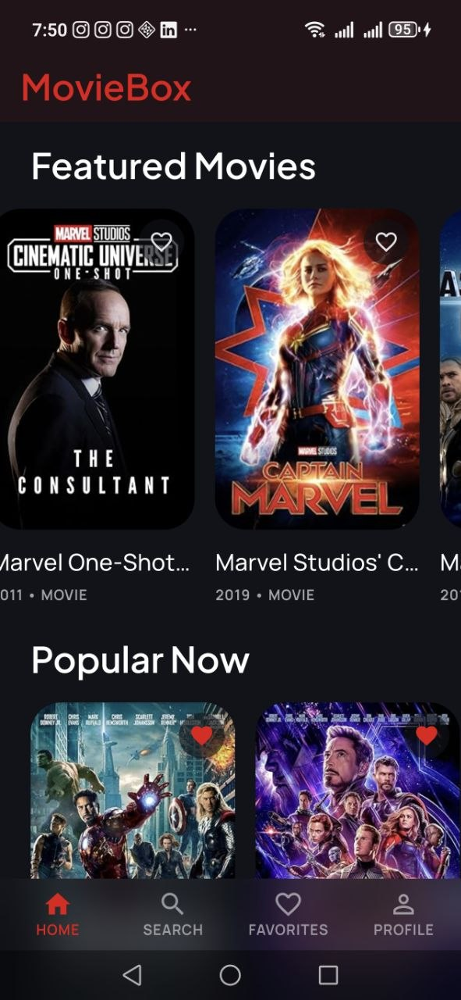
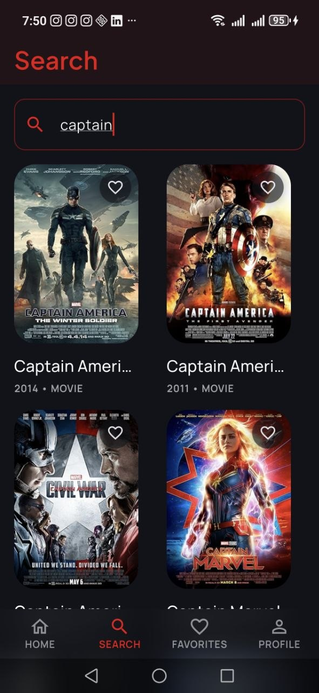
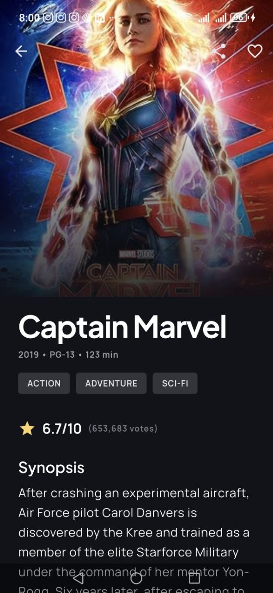
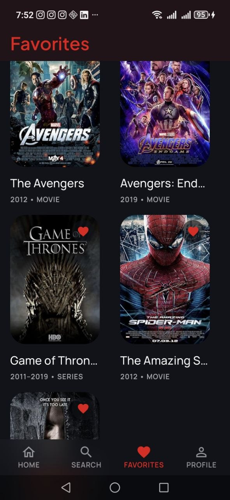
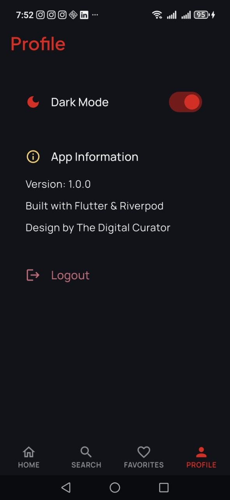

# moviebox

A new Flutter project.

## Getting Started

---

# Next — README for Movies App

Here is another professional one for your **Movies App**.

# 🎬 Movies & Series App

A Flutter application that allows users to explore movies and TV series with detailed information, ratings, and search functionality.

---

## ✨ Features

- 🎥 Browse popular movies
- 📺 Browse TV series
- 🔍 Search movies and series
- ⭐ View ratings and details
- 📝 Movie descriptions
- 🎨 Modern UI design

---

## 🛠️ Technologies Used

- Flutter
- Dart
- OMDb API
- REST API Integration
- JSON Parsing

---

## 📸 Screenshots

```markdown
### 🎬 Movies Screen


### 🔍 Search Screen


### 📄 Details Screen


### 📄 Faivorites Screen


### 📄 Profile Screen


